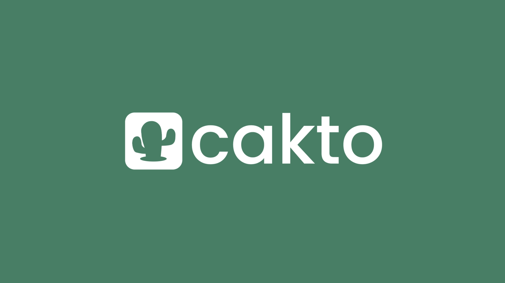
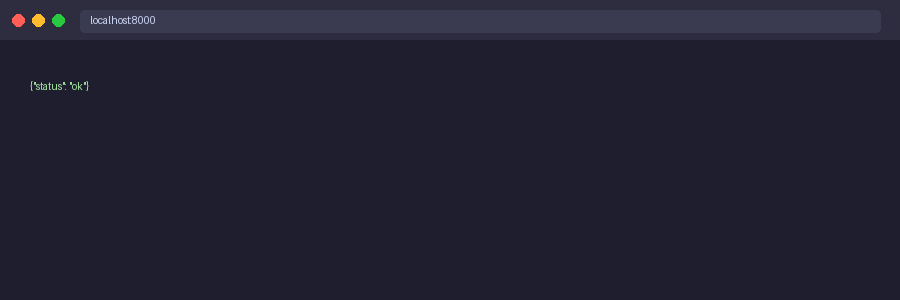

<div align="center">
  
</div>

# desafio-cakto-split-engine

Mini Split Engine + Ledger + Outbox — Teste Prático Backend Sênior (Cakto)

## Stack

- Python 3.11 + Django 5 + Django REST Framework
- PostgreSQL 16 (produção / Docker)
- SQLite (testes automatizados, sem dependência externa)
- Docker + Docker Compose para ambiente isolado

## Como rodar

### Com Docker (recomendado)

```bash
docker compose up --build
```

A API estará disponível em `http://localhost:8000`.

### Localmente (sem Docker)

```bash
pip install -r requirements.txt
python manage.py migrate
python manage.py runserver
```

> Sem `DATABASE_URL` no ambiente, o Django usa SQLite automaticamente.

## Endpoints

### POST `/api/v1/payments`

Confirma um pagamento, persiste no banco e gera ledger + outbox.

**Headers:**
```
Idempotency-Key: <uuid-or-string>
Content-Type: application/json
```

**Body:**
```json
{
  "amount": "297.00",
  "currency": "BRL",
  "payment_method": "card",
  "installments": 3,
  "splits": [
    { "recipient_id": "producer_1", "role": "producer", "percent": 70 },
    { "recipient_id": "affiliate_9", "role": "affiliate", "percent": 30 }
  ]
}
```

**Response 201:**
```json
{
  "payment_id": "pmt_xxxxxxxx",
  "status": "captured",
  "gross_amount": 297.0,
  "platform_fee_amount": 26.70,
  "net_amount": 270.30,
  "receivables": [
    { "recipient_id": "producer_1", "role": "producer", "amount": 189.21 },
    { "recipient_id": "affiliate_9", "role": "affiliate", "amount": 81.09 }
  ],
  "outbox_event": { "type": "payment_captured", "status": "pending" }
}
```

### POST `/api/v1/checkout/quote`

Mesma request, sem persistir — apenas retorna os valores calculados.

## Rodando os testes

```bash
python manage.py test payments.tests --verbosity=2
```

14 testes, todos passando.



---

## Decisões técnicas

### 1. Como garantiu precisão e arredondamento

Todos os valores monetários são representados como `Decimal` do Python. Nunca se usa `float` para dinheiro. O fluxo é:

1. O `amount` do request chega como string e é convertido imediatamente para `Decimal` no serializer.
2. A taxa (`fee_rate`) é calculada como `Decimal` e multiplicada pelo valor bruto com precisão total.
3. Apenas no momento de gravar/retornar o valor é que se aplica `.quantize(Decimal("0.01"))`.

No banco, os campos usam `DecimalField(max_digits=12, decimal_places=2)`, que mapeia para `NUMERIC(12,2)` no PostgreSQL — sem ponto flutuante.

### 2. Regra de centavos e por quê

Estratégia: **floor + remainder para o primeiro recebedor**.

- Cada share é calculado como `net * percent / 100`, arredondado para baixo (`ROUND_DOWN`).
- A soma dos floors pode resultar em um resíduo de 1 ou 2 centavos a menos que o `net`.
- Esse resíduo é somado ao primeiro recebedor da lista.

**Por quê floor e não round?** Floor garante que nunca distribuímos mais do que o `net_amount`. Distribuir a mais seria um erro financeiro — a plataforma estaria pagando centavos do próprio bolso. O produtor (primeiro da lista) leva o bônus do centavo, o que é convencional no setor.

**Invariante garantida:** `sum(receivables) == net_amount` sempre, verificada pelos testes.

### 3. Estratégia de idempotência

O modelo `Payment` tem um campo `idempotency_key` (unique index) e `payload_hash` (SHA-256 do payload canonicalizado com `sort_keys=True`).

Comportamento:
- **Mesma key + mesmo payload** → busca o registro existente e retorna HTTP 200 com o mesmo resultado. Zero escrita no banco.
- **Mesma key + payload diferente** → HTTP 409 Conflict com mensagem explicativa. A transação original não é alterada.
- **Sem key** → processa normalmente (sem proteção de idempotência).

A criação do Payment + LedgerEntries + OutboxEvent é feita dentro de um `transaction.atomic()`, garantindo que ou tudo é gravado ou nada.

### 4. Métricas que colocaria em produção

- `payment.created.count` — volume de pagamentos capturados por minuto
- `payment.fee.amount` — soma de receita de taxa por janela
- `payment.idempotency.conflict.count` — tentativas duplicadas com payload diferente (sinal de bug no cliente)
- `outbox_event.pending.gauge` — fila de eventos pendentes (alerta se crescer sem parar)
- `payment.latency.p99` — latência do endpoint `/payments` no percentil 99

### 5. Se tivesse mais tempo, o que faria a seguir

- **Worker de outbox**: processo que publica os `OutboxEvent` pendentes em um broker real (SQS, RabbitMQ) e atualiza `status=published` + `published_at`.
- **Autenticação**: API key ou JWT para identificar quem está submetendo pagamentos.
- **Paginação e endpoint GET /payments/:id**: para reconciliação e auditoria.
- **Rate limiting** por `Idempotency-Key` / IP para evitar abuso.
- **Retry idempotente no outbox**: reprocessamento seguro com backoff exponencial.
- **Testes de contrato** (schema) para garantir que a response não quebra clientes.

## Como usei IA

Usei Claude Code (claude-sonnet-4-6) para:
- Gerar o scaffold do projeto (estrutura de arquivos, settings Django).
- Implementar a lógica de negócio (`split_calculator.py`), validando manualmente a matemática dos exemplos do PDF.
- Escrever os testes automatizados (todos os 5 cenários obrigatórios + extras).
- Redigir este README.

Todo o código foi revisado e validado: os 14 testes passam localmente (`python manage.py test`).

## PR

Branch: `feature/payment-split-ledger` → `main`

> https://github.com/phpenterprise/desafio-cakto-split-engine/pull/2
